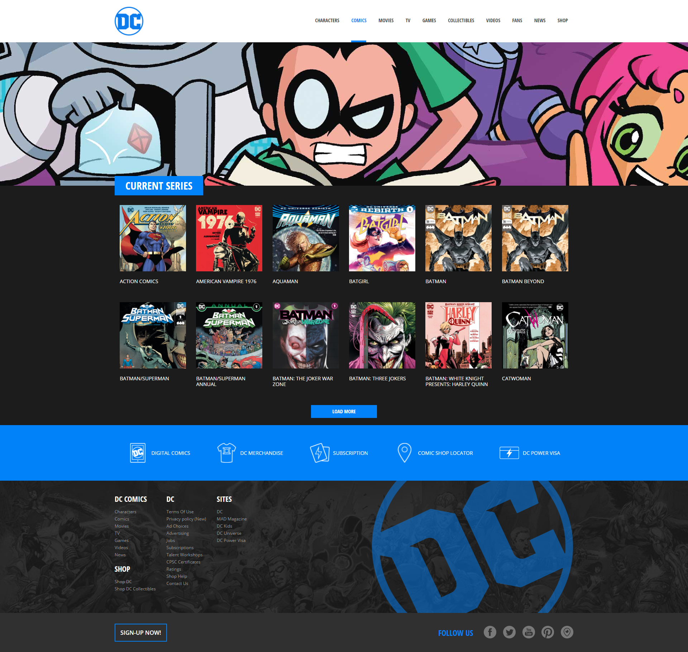

# 🦸‍♀️ Laravel Comics 🦸‍♂️

## 📖 Descrizione
**Nome repo:** `laravel-comics` 
Proviamo a replicare il layout di un sito basandoci sullo screenshot in allegato! 📸

## 🚀 Svolgimento
1. **🏗️ Setup Progetto** - Creiamo un nuovo progetto Laravel
2. **🎨 Layout Structure** - Concentriamoci sul layout: creiamo un file di layout in cui inserire la struttura comune di tutte le pagine del sito web (tag head, tag body, ...) eventualmente includendo header e footer tramite due partials
3. **📚 Comics Route** - Creiamo poi una rotta per visualizzare la lista di tutti i fumetti recuperati dal file `comics.php` che trovate in allegato, inserendoli nella cartella `config`
4. **💅 Styling** - Abbelliamo il tutto sfruttando SASS

## 🎯 Bonus 1
Creare più pagine istituzionali che condividono lo stesso layout

## 🎯 Bonus 2
Creare uno o più componenti da condividere tra le varie pagine